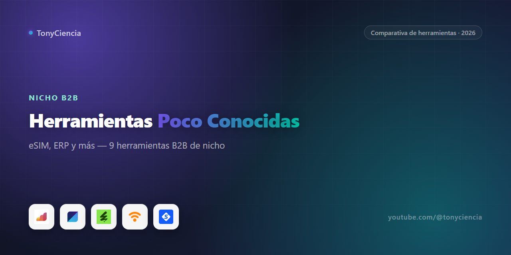

# Herramientas B2B que probablemente no conocías (pero que resuelven un problema real) — 2026

Esto no es un ranking de "la mejor herramienta de X". No podría serlo: las nueve marcas de esta lista no compiten entre sí, no venden lo mismo y probablemente ni siquiera saben que existen las otras. Lo que tienen en común es que cada una resuelve un problema muy específico de un tipo de negocio muy específico — y que, salvo que trabajes justo en ese nicho, es fácil no haber oído hablar de ninguna.

Si administras una obra de construcción, coordinas viajes corporativos en Europa, produces contenido para YouTube o gestionas una fábrica pequeña, probablemente ya sabes que las herramientas "genéricas" (Excel, WhatsApp, un ERP gigante pensado para otra industria) se quedan cortas. Aquí van nueve que fueron construidas para el problema puntual, no para el caso general.

## Resumen rápido

| | Herramienta | Para qué sirve | |
|---|---|---|---|
|  | **Airalo** | eSIM para viajeros — datos móviles en el extranjero sin chip físico | [Probar →](https://airalo.pxf.io/c/6249333/1268485/15608) |
|  | **eSIMX** | eSIM para viajeros — alternativa a Airalo | [Probar →](https://skylarkconnectllc.pxf.io/c/6249333/2147759/27320) |
|  | **Bolt for Business** | Gestión de viajes corporativos (rides y scooters) en Europa | [Probar →](https://get.business.bolt.eu/krmf60n1ozxg) |
|  | **Contractor Foreman** | Software de gestión para contratistas de construcción | [Probar →](https://try.contractorforeman.com/ufxanryzfnpw) |
|  | **MRPeasy** | ERP/MRP de manufactura para fabricantes pequeños y medianos | [Probar →](https://try.mrpeasy.com/rlpqvvl89747) |
|  | **PDWare** | Software de gestión de proyectos y datos de producto (PDM) | [Probar →](https://try.pdware.com/9fk32py2xnnn) |
|  | **Scrums.com** | Equipos de desarrollo de software tercerizados, on-demand | [Probar →](https://scrumscom.pxf.io/c/6249333/2957867/35139) |
|  | **Envato** | Biblioteca de recursos creativos por suscripción (templates, música, video, fuentes) | [Probar →](https://1.envato.market/c/6249333/298927/4662) |
|  | **iMobie** | Utilidades de backup, gestión y reparación para iPhone | [Probar →](https://imobie.sjv.io/c/6249333/619738/10066) |

## Conectividad para viajeros: Airalo vs. eSIMX

Estas dos sí valen la pena comparar directamente, porque hacen exactamente lo mismo: te venden una eSIM (una SIM digital) para tener datos móviles apenas aterrizas en otro país, sin buscar una tienda ni pagar roaming de tu operador local.

**Airalo** es la más conocida de las dos y tiene el catálogo de países más amplio, con planes que van desde unos pocos días hasta 30+ y opciones regionales (por ejemplo, un plan que cubre toda Europa en vez de comprar uno por país). Es la opción más segura si viajas seguido a destinos distintos y quieres una app con historial y buena cobertura de soporte.

**eSIMX** apunta al mismo problema pero con foco en precio y en activación simple. Si tu ruta de viaje es más predecible (siempre los mismos 2-3 países, o un solo destino largo) vale la pena comparar el precio del plan específico antes de decidir — en eSIM el costo por GB varía bastante de un proveedor a otro incluso para el mismo país. Ninguna de las dos requiere chip físico ni visita a tienda; ambas se activan escaneando un código QR desde el celular.

## Software de gestión para industrias específicas

Este es el grupo más grande de la lista y el que mejor explica por qué este no es un ranking: **Contractor Foreman**, **MRPeasy** y **PDWare** resuelven el mismo problema de fondo — "necesito controlar costos, tiempos y recursos de un proyecto complejo" — pero para tres industrias que no se parecen en nada entre sí.

**Contractor Foreman** está construido para contratistas de construcción: presupuestos, órdenes de cambio, control de horas de cuadrillas en obra, seguimiento de subcontratistas y documentación fotográfica del avance. Si tu negocio todavía coordina obras por grupo de WhatsApp y hojas de cálculo sueltas, este es el tipo de herramienta que existe específicamente para reemplazar ese caos.

**MRPeasy** es un ERP/MRP pensado para fabricantes pequeños y medianos — planificación de producción, control de inventario de materia prima, órdenes de compra y trazabilidad de lotes. La mayoría de los ERP grandes (SAP, Oracle) están sobredimensionados y son carísimos para una fábrica de 20-100 personas; MRPeasy existe en ese punto intermedio.

**PDWare** se enfoca en gestión de proyectos y datos de producto (PDM), útil para equipos que necesitan mantener control de versiones, especificaciones técnicas y flujo de aprobación de documentos de un producto a lo largo de su desarrollo — un problema distinto al de manufactura pura o construcción, pero igual de específico.

## Desarrollo de software tercerizado: Scrums.com

Si necesitas un equipo de desarrollo pero no quieres (o no puedes todavía) contratar ingenieros internos, **Scrums.com** ofrece equipos completos on-demand — no freelancers sueltos, sino escuadras ya formadas que se integran a tu proyecto con metodología ágil. Es una categoría distinta a una agencia tradicional o a una plataforma de freelancers tipo Upwork: la propuesta es escalar o reducir el equipo según la fase del proyecto sin pasar por todo el ciclo de contratación cada vez.

## Recursos creativos por suscripción: Envato

**Envato** (a través de Envato Elements) es una biblioteca de suscripción con templates, música libre de derechos, video stock, fuentes y gráficos. Si produces contenido con cierta regularidad —videos, presentaciones, publicidad— y te cansaste de buscar recurso por recurso en sitios sueltos, la suscripción cubre casi todo lo que necesitás en un solo lugar en vez de pagar por pieza.

## Utilidades para iPhone: iMobie

**iMobie** cubre un problema puntual: gestión, respaldo y reparación de iPhone fuera del ecosistema estándar de Apple — recuperar datos de un teléfono que no enciende, hacer backups más flexibles que iCloud, o transferir datos entre dispositivos sin depender de una sola nube. Útil tanto para uso personal como para quien administra varios dispositivos de una empresa.

## Movilidad corporativa: Bolt for Business

**Bolt for Business** gestiona viajes corporativos en Europa —rides y scooters— con facturación centralizada, políticas de gasto por empleado y reportes consolidados en vez de que cada persona suba su propio recibo de Uber al final del mes. Tiene sentido sobre todo para empresas europeas con equipos que se mueven seguido entre oficinas o reuniones con clientes.

## Cómo armamos esta lista

Estas nueve son partnerships activos que tenemos desde hace tiempo, pero que nunca encajaron en ninguna de nuestras comparativas grandes porque no compiten con nada más en nuestro catálogo. En vez de dejarlas sueltas, las agrupamos acá. No es una selección "de las mejores del mundo en su categoría" — es honestamente una mezcla ecléctica de herramientas de nicho que probamos o investigamos y que nos parecieron útiles para el tipo de negocio al que le sirven. Si tu negocio no cae en ninguno de estos seis grupos, es probable que ninguna de estas nueve te sirva, y está bien — no es esa la idea.

## Preguntas frecuentes

**¿Por qué juntar herramientas tan distintas en un mismo repo?**
Porque cada una es demasiado nicho para justificar su propia comparativa (no hay 5 competidores directos de MRPeasy que valga la pena poner cabeza a cabeza, por ejemplo), pero sí vale la pena que existan en algún lugar donde alguien buscando por ese problema específico las encuentre.

**¿Airalo o eSIMX, cuál elijo?**
Depende de tu ruta de viaje. Si visitas países distintos seguido, Airalo tiene más cobertura y planes regionales. Si tu destino es predecible, compara el precio específico del plan en cada una — a veces cambia bastante para el mismo país.

**¿Estos links son de afiliado?**
Sí, todos. Ver el disclosure abajo.

### Sobre este repo

Este listado lo arma el equipo de **TonyCiencia** (canal de YouTube). Los links de "Probar →" son de afiliado: si te suscribís o comprás a través de ellos, puede que recibamos una comisión, sin costo extra para vos. No incluimos testimonios inventados ni cifras de uso que no podamos respaldar — si una herramienta no la usamos a diario, lo decimos en el texto.

Última actualización: 2026-08.
